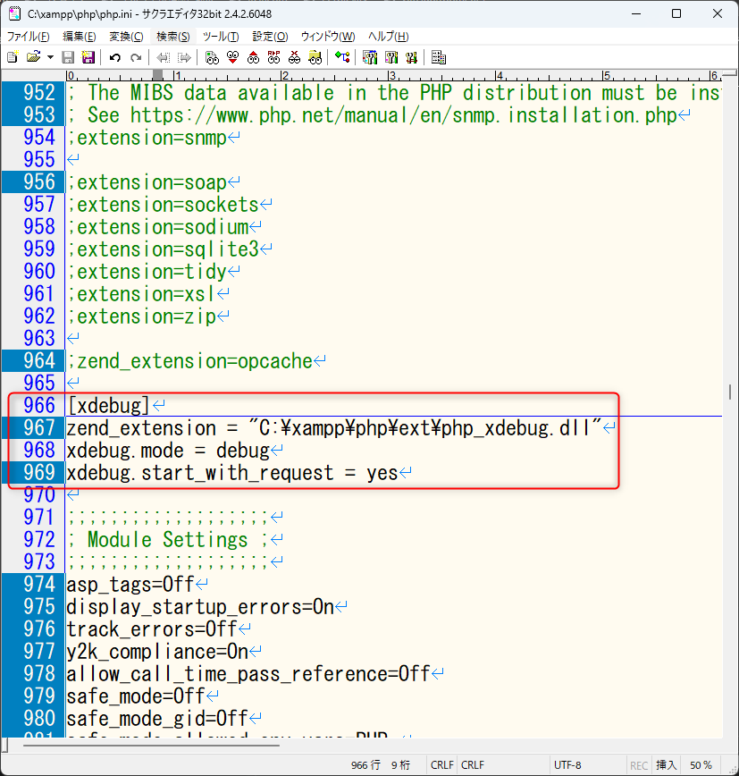
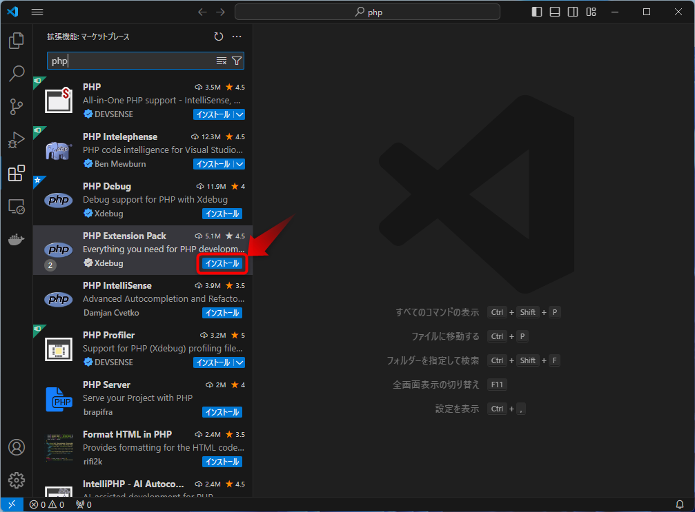
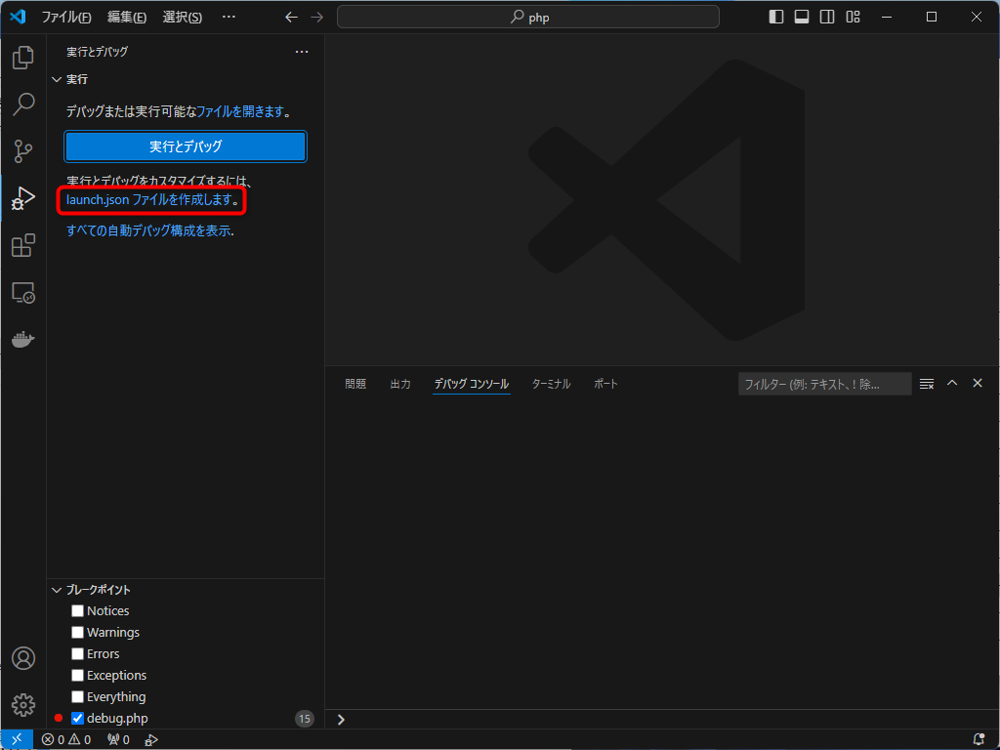
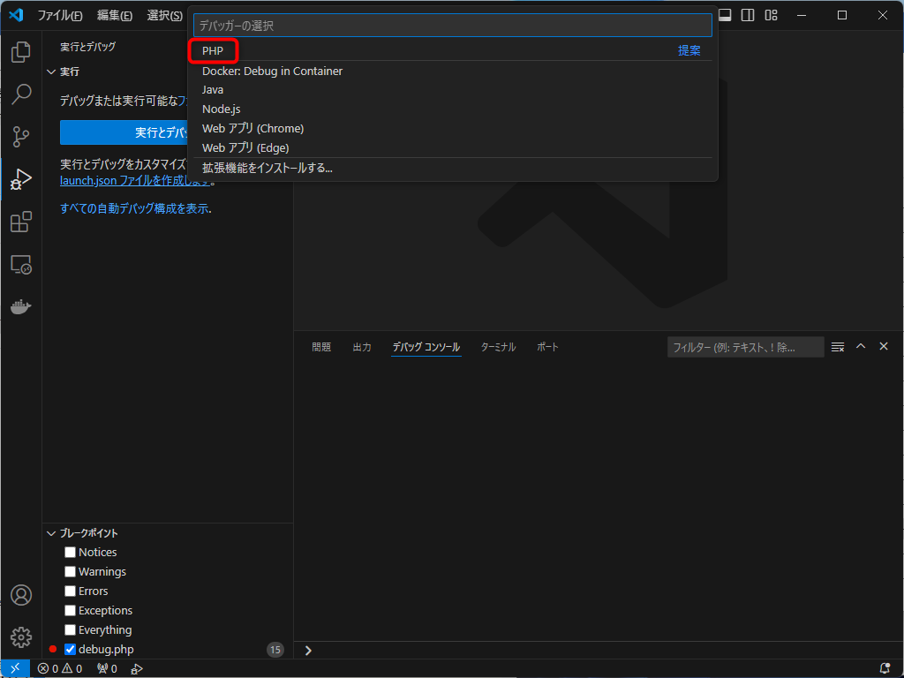
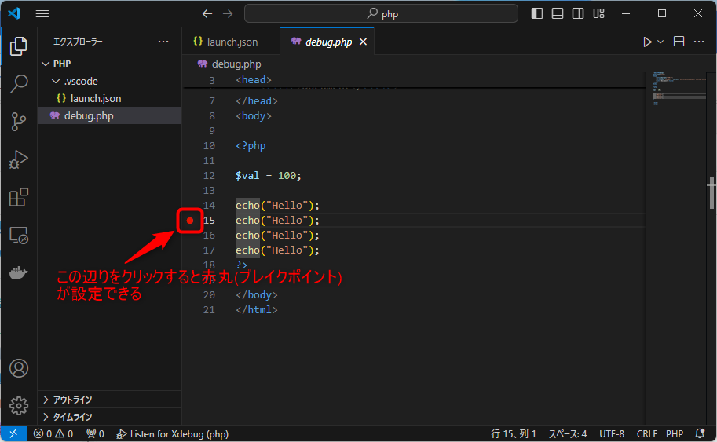
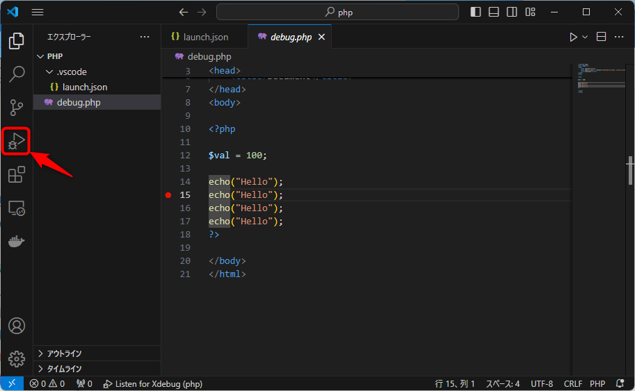
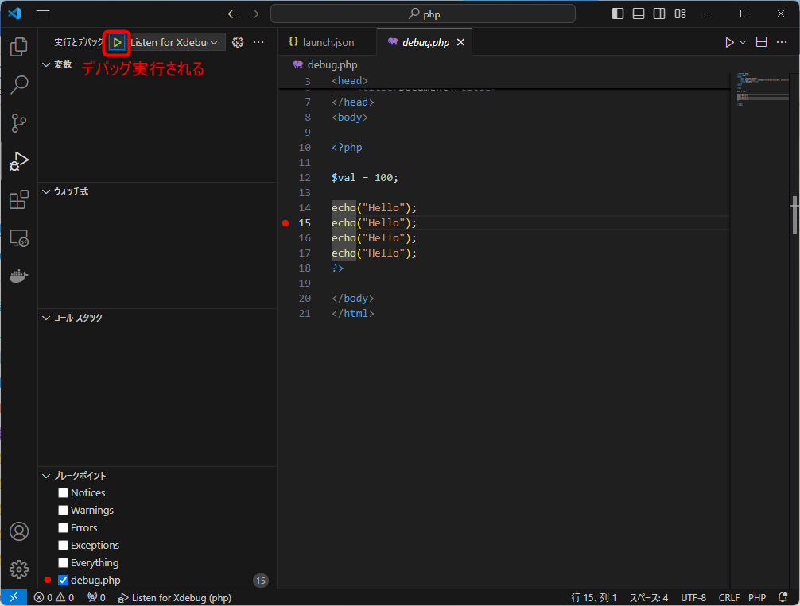
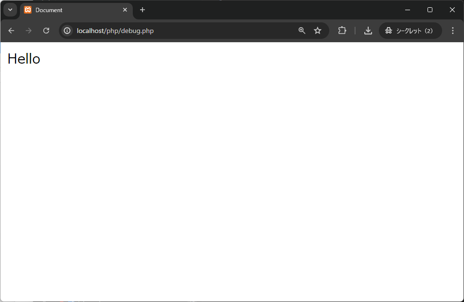
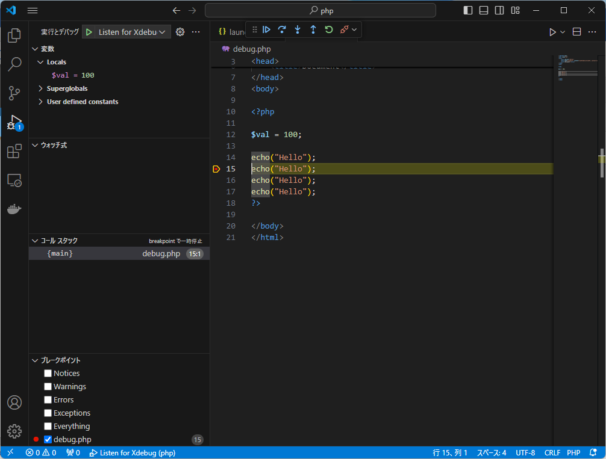

# VSCode + XAMPP + Xdebugの設定手順

## 自動インストールと設定バッチ

[`install.vbs`](https://github.com/room202/xampp-xdebug/raw/main/install.vbs)を実行すれば全部の設定をしてくれるハズ

## Xdebug Wizard

[https://xdebug.org/wizard](https://xdebug.org/wizard)

## Xdebugのインストール

- [このファイル](https://github.com/room202/xampp-xdebug/raw/main/php_xdebug.dll)をダウンロードする

- ダウンロードしたファイルを`C:\xampp\php\ext\`に配置する

## php.iniの設定

`C:\xampp\php\php.ini`を開いて966行目付近に、下記を追記

```ini
[xdebug]
zend_extension = "C:\xampp\php\ext\php_xdebug.dll"
xdebug.mode = debug
xdebug.start_with_request = yes
```



## Apacheの再起動

`XAMPP Control Panel`から`Apache`を再起動する

## VSCodeの設定

拡張機能から`PHP Extension Pack`を追加



`launch.json ファイルを作成します。`ボタンをクリック



言語選択メニューが表示されたら`PHP`を選択する




## デバッグの方法

### ブレークポイントの設定



### デバッグの実行

`実行とデバッグ`ボタンをクリックする



`デバッグの開始`ボタンをクリックする



対象のPHPファイルをChromeで表示する



VSCode側を見るとブレイクポイントでプログラムが止まる


